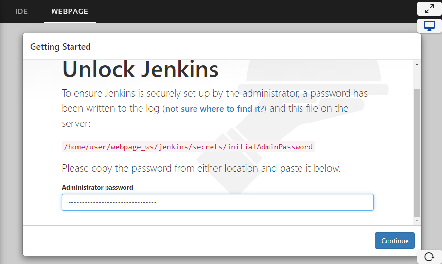
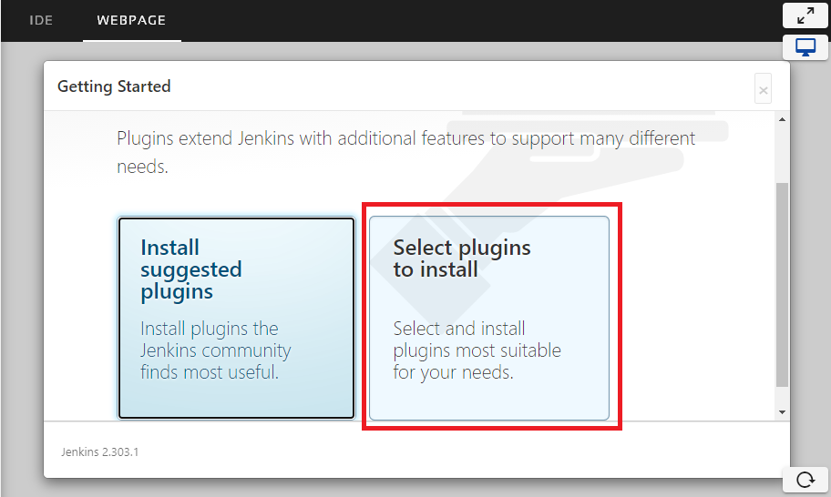
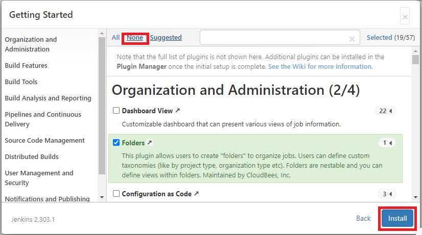
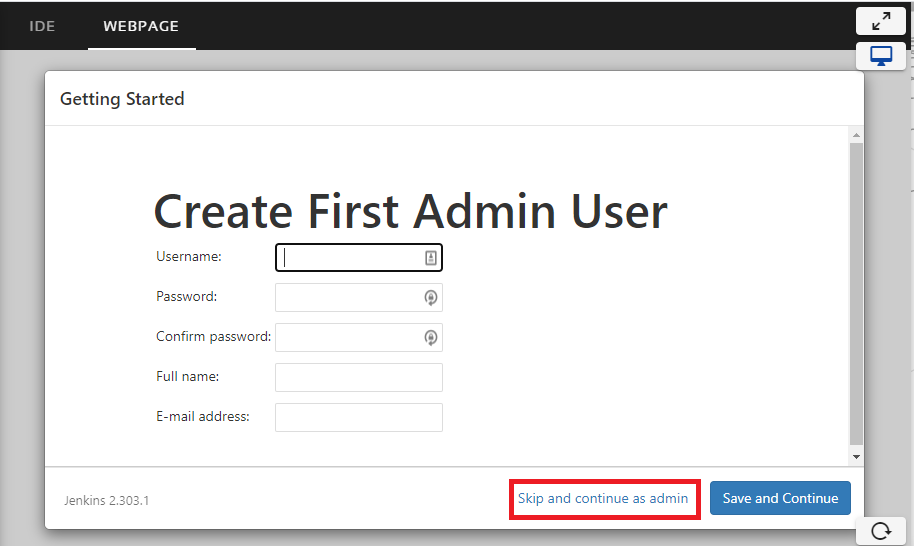
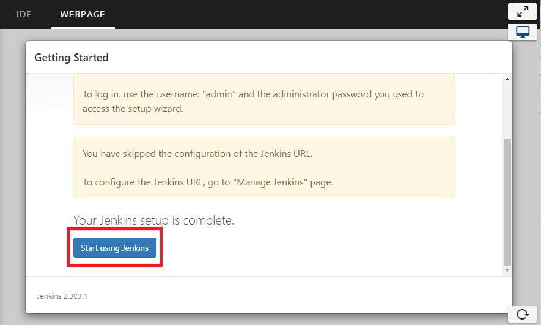

# Checkpoint24_1o2_Jenkins_Ros1

## Quick guide

## Jenkins

### Install Jenkins
Terminal 1

```
cd ~/webpage_ws
./start_jenkins.sh | grep URL
```
Copy the URL address starting from "https://" to the end of the line, and paste to browser, or alternatively, place ctrl while click on the word "https"

Go to web browser, with corresponding site. From now on this web browser, with this address, will be called Jenkins website.

Open the file ~/webpage_ws/jenkins_installation_log.log looks for something like

```
Jenkins initial setup is required. An admin user has been created and a password generated.
Please use the following password to proceed to installation:

299263e4d7c34fb9b85d689ae603fda5
```

The number at the position of "299263e4d7c34fb9b85d689ae603fda5" is the password. Copy that to clip board, and paste this into password input box in the jenkins website.







Finally a working jenkin website. Later will be call dashboard, as you can see there is a word dashboard in the image.


If you happen to get to the dashbord image without installing procedures before, just do the next step.

###  Create an empty Jenkins pipeline for automating the test process
- follow Section24, Unit 10.8 until the end.

## Build and run dockers manually

build docker 

```
docker build -t tortoisebot-waypoints-test:v1 .
```

- Running on the construct's computer

```
docker context use default
xhost +local:root
docker run -it --rm -e DISPLAY=$DISPLAY -v /tmp/.X11-unix:/tmp/.X11-unix -tortoisebot-waypoints-test:v1 
```
- Running on my Local computer

```
docker context use default
xhost +local:root
docker run -it --rm -e DISPLAY=$DISPLAY -v /tmp/.X11-unix:/tmp/.X11-unix --gpus all --net=host tortoisebot-waypoints-test:v1 
```


